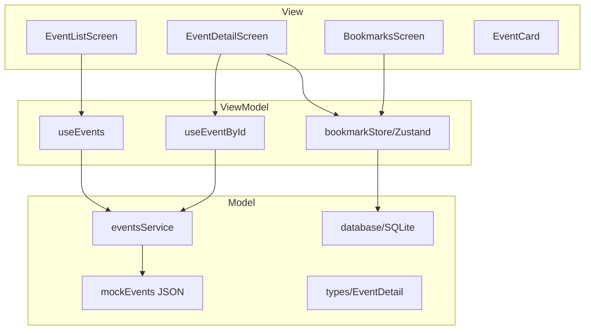
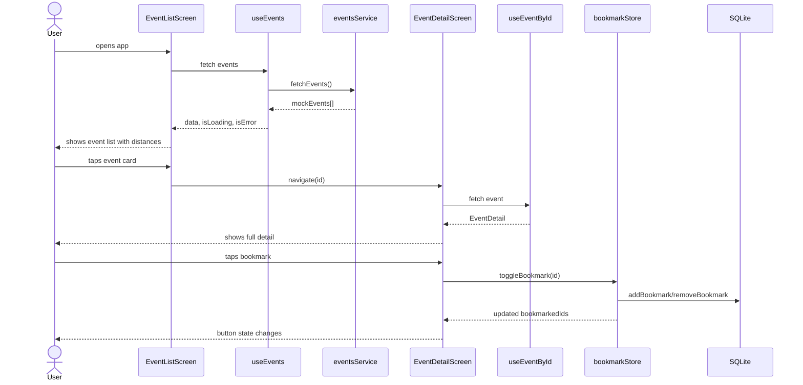

# EventApp
This is an Local Events Explorer app, allowing users to list and browse events nearby, let users bookmark events, and shows event details.

## Requirements
• Platform: Native iOS (Swift) or Android (Kotlin) or cross-platform (React Native/Flutter).
• API: Use a provided mock REST endpoint (or a simple JSON file) for events (id, title, location,
time, image URL).
• Local DB: Persist bookmarks and last-fetched events (SQLite/Room/CoreData/Realm).
• Cache: Implement image caching and a simple in-memory or disk cache for API responses with
TTL.
• Native features: Request location permission; show distance to event; deep link to maps app
for navigation.
• Resource use: Background refresh to update events (low frequency), handle network failures
gracefully.
• Standards: MVVM/MVC, dependency injection, unit tests for core logic, linting, README with
run steps.

## Overview
EventApp is a cross-platform mobile app built with React Native + Expo that helps users 
discover and track local events. Users can browse nearby events with real-time distance 
calculations, view full event details, bookmark favourites, and navigate to venues via 
native Maps integrationß. Built with production-minded MVP in mind to demonstrating clean 
architecture, local persistence, API caching, and native platform features.

## Architecture
MVVM pattern:
- Model: src/types/events.ts, src/db/database.ts, src/features/events/eventsService.ts
- ViewModel: src/features/events/useEvents.ts, src/features/bookmarks/bookmarkStore.ts
- View: src/components/EventCard.tsx, src/features/events/EventListScreen.tsx

MVVM mermaid:

Navigation: React Navigation with bottom tabs (2) + native stack per tab
State management: TanStack Query for server state, Zustand for local bookmark state
Persistence: SQLite via expo-sqlite for bookmarks

## Sequence Diagram mermaid:

## Tech Stack
| Tool | Purpose | Reason |
|------|---------|--------|
| React Native + Expo | Cross-platform framework | Single codebase for iOS/Android, physical device testing via Expo Go, eliminate double efforting |
| TypeScript | Type safety | Catches errors at compile time |
| NativeWind | Styling | Tailwind CSS for React Native, faster than StyleSheet |
| TanStack Query | API cache + state | Handles loading/error/retry/TTL automatically |
| Zustand | Bookmark state | Lightweight global state, no boilerplate |
| expo-sqlite | Local persistence | Bookmarks survive app restarts |
| expo-location | GPS | Native location permission + coordinates |
| expo-image | Image loading | Built-in disk cache, better than RN Image |
| React Navigation | Routing | Industry standard, bottom tabs + stack navigator |

## Setup & Run
Prerequisites: Node.js 18 or above, Expo Go app on device

git clone <repo-link>
cd eventapp
npm install
npx expo start

Scan QR code with:
- iOS: Camera app
- Android: Expo Go app

Run tests:
npx jest (--verbose)

## Features
- Browse nearby events with distance calculated via Haversine formula
- View full event details including venue, time, organizer, description
- Bookmark/unbookmark events with SQLite persistence across app restarts
- One-tap navigation to venue via native Maps deep link
- Cached image loading via expo-image
- Background event refresh every 15 minutes
- Graceful error handling with retry on network failure
- Location permission request with fallback handling

## Trade-offs & Decisions
"Used mock JSON over real API: requirements explicitly support mock data as valid approach. Real API swap requires only eventsService.ts change — service layer decoupled for this reason (intended)"
- Deep link to Maps over embedded SDK: zero dependency, no API key, native UX, reduces bundle size - trade off - switches to another native app (Google Maps/Apple Maps)
- Haversine implemented from scratch: demonstrates algorithm understanding, no external dependency
- SQLite for bookmarks only: bookmarks are user-local, no sync needed, TTL unnecessary, can easily be implemented
- TanStack Query for API cache: handles loading/error/retry/TTL automatically vs manual state management
- Background fetch minimum 15min: iOS enforced floor, documented as known platform constraint.

## Future Improvements
- Real REST API replacing mock JSON from app
- Server-side bookmark sync across devices
- Push notifications for upcoming bookmarked events
- Search and filter by category/distance
- User authentication via Clerk or other platforms/services